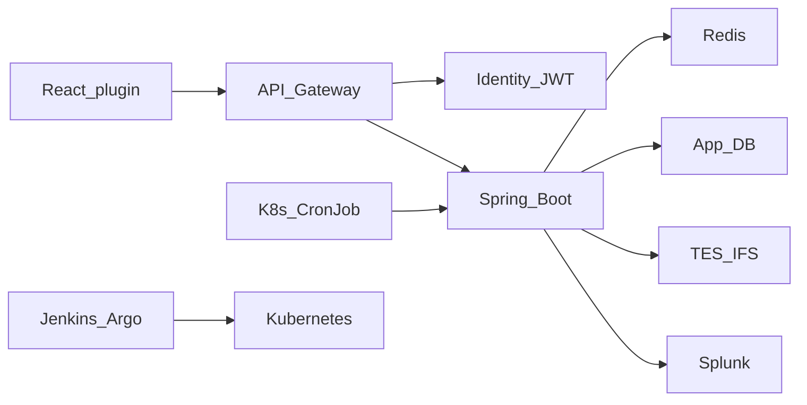

# Request path: UI to Kubernetes

Use this when they say “walk me through your system” or “how does a request flow?” Then offer tax exemption as the **scheduled** path.

## Path A — user click (interactive)

1. **Browser.** User is on QuickBooks. Feature lives in a **plugin/widget**, not a giant monolith. Feature flags (IXP) can hide the UI for a percentage of users.
2. **AuthN.** Session/OAuth login. Browser sends **JWT** (or cookie that the gateway/BFF exchanges). Identity service answers: is this user valid, and what roles?
3. **API gateway.** Routes `/graphql` or REST to the right service. Applies TLS termination, rate limits, and sometimes a global auth check. Gateway is **not** the only authorization.
4. **Spring Boot service.** Controller or GraphQL resolver. **Authorization** (roles, firm, subscription tier) is enforced here. Hiding a button in React is not security.
5. **Data.** Redis for hot/read-mostly data; DB for source of truth. Downstream HTTP to TES, IDLM/IFS, billing, etc.
6. **Resilience.** Timeouts, retries on **transient** errors, circuit breaker so a dead TES does not exhaust threads.
7. **Response.** GraphQL returns only requested fields (why you moved off “fetch the whole object”). Correlation ID is in logs.
8. **Runtime.** Same code is a **Docker image** running as a **Pod** behind a **Service**; ingress/gateway in front. Jenkins builds plugin versions; Argo CD (or equivalent) syncs cluster state.

**60-second recitation:** “Click in the plugin, JWT to the gateway, routed to a Spring Boot service, authZ in the service, Redis or DB, downstream with a circuit breaker, logs with a correlation ID, all of that on Kubernetes.”

## Path B — tax exemption (async to the user, sync steps in the job)

This is the zoom-in from HLD §§6–16. The user already **submitted** the certificate. Processing is not “one REST call does everything.”

1. Kubernetes **CronJob** fires on a schedule.
2. `concurrencyPolicy: Forbid` so a new Job is not started while the previous pod is still running. Application still locks **each record** (DB `FOR UPDATE SKIP LOCKED` or Redis lock with TTL) so a manual re-run cannot double-process.
3. Scheduler loads **pending** exemption requests.
4. **Per-record isolation:** one failure does not abort the batch.
5. Pipeline (orchestration Saga), conceptually:

   lock → fetch account (IUS/IDLM) → build payload → create customer (TES, with retry) → update our DB → update IFS status

6. `ExemptionRequestContext` holds stage and intermediate data.
7. On failure: stop forward steps; **compensate in reverse** only steps that `requiresCompensation()`; persist retry/status; next record.
8. Customer tracks status in the UI via a later read API/GraphQL.

**Do not say:** this is a distributed XA transaction, or that Kafka drives these six steps.

**User-facing “async” (recording 67):** `POST` returns **201** with status `CREATED`. The customer does not wait for TES. A CronJob (you said ~30 minutes — use the real schedule) later runs the Saga. That is **async to the user**, still **synchronous HTTP steps inside the job**. It is not Kafka.

**Avalara vs plugin (only if true):** some products email a link to **Avalara** (transcript: “Alvara”) to upload the certificate, 30-day window, **one open request**. After vendor verification, status moves in-progress → completed and other services update. If your HLD is **in-plugin upload + S3**, do not add Avalara. If both exist, say: create in QuickBooks → cert in Avalara → our job consumes verified status → TES Saga.

## Authentication vs authorization

| | Authentication | Authorization |
| --- | --- | --- |
| Question | Who is the user? | What may they do? |
| Typical tools | OAuth2, JWT, identity service | Roles, firm membership, feature flags, method/security annotations |
| UI | Login redirect | Hide menu items |
| Backend | Validate token signature and expiry | Check permission **again** on every mutation |

**Interview line:** “If the UI hides tax exemption but the API accepts the mutation, that is a security bug. We enforce on the service.”

**JWT shape (recordings 64–65):** login → identity service verifies credentials → **JWT** (header, **payload** with subject/roles, **signature**). Browser stores cookie or `Authorization: Bearer`. Gateway checks signature/expiry; **each service** still checks role for the operation. Filter 401 vs controller advice: [04-backend-java-spring.md](04-backend-java-spring.md).

## REST design in this architecture (ASTON Q5)

- Resource names, nouns, HTTP verbs: `POST /exemption-requests`, `GET /exemption-requests/{id}`.
- Idempotency key on create (request id) so double-submit does not create two cases.
- Sync **user** calls: short, read/write that must return now.
- Sync **service-to-service**: OpenFeign/WebClient with timeouts.
- Async **when** work is long or multiple consumers need the event (not this Saga).
- Rec 67 listed gateway, LB, rate limit, Redis, SOLID, Docker — those are **platform**, not REST design. Lead with resources, status codes, idempotency, then Feign.

## GraphQL vs REST in the same product

You told interviewers: REST returned bulky objects; GraphQL + Apollo lets the plugin ask for name, status, eligibility only. Keep REST for commands/webhooks/other services if that is how TES is called. Do not claim “everything is GraphQL.”

## Service communication cheat sheet

| Style | When you used it | Failure mode |
| --- | --- | --- |
| Sync HTTP | Plugin → gateway → service; service → TES | Caller waits; use timeout + CB |
| Scheduler/Saga | Tax exemption batch | Compensation + retry counters |
| Kafka | Separate event/cache flows | Consumer lag, duplicate delivery |

## HLD → LLD progression (HLD §17)

| They ask | You answer |
| --- | --- |
| Project HLD | Path A |
| Pick a feature | Tax exemption Path B |
| Why Saga | Multi-step, external systems, sequence, per-record failure |
| LLD | Pipeline, `ProcessingStep`, context, clients, repos (HLD §§12–15) |
| Step 4 fails | Compensate reverse; retry/status; next record |
| K8s starts another job | Forbid + row lock (HLD §7) |

## Security and resilience on the path (HLD §18)

Gateway: routing + coarse auth. Service: method-level authZ. Downstream TES: **its own** credentials — do not mix “user JWT” with “job uses service account” unless you explain both.

Circuit breaker sits on **outbound** calls. Fallback: cached eligibility or a safe error message, never a fake “exemption approved.”

## Practice

Explain Path A in 60s, Path B in 90s, then one question from HLD §20 without looking.
